## Course discovery and booking workflow #1

### Overview

This document outlines the workflow for course discovery and booking using DSEP. The workflow includes interactions between the app (BAP) and the course provider (BPP) for search, select, booking, and completing the courses.

A typical workflow for course discovery consists of the following steps:

#### Step 1: The BAP searches for courses

The BAP provides inputs to find the relevant courses on the providers. The search can be based on the course name, provider or category, or a combination of all three.
Additionally the BAP can fire a search for a specific course item, to get more information of that course.

#### Step 2: Provider sends catalogs of all the matching courses

The provider platform (BPP) sends the catalogs of matching courses to the BAP.
The catalog will consist of various courses they provide along with their respective attributes such as the course provider, course instructor, course preview.

Additionally when the BPP gets a search request for a specific item, the BPP can respond with the catalog of that iteam with additional information of eligiblity criteria and the pre-requisites for the course.

#### Step 3: The BAP selects a course

The BAP selects the course(s) (items) from the provider that they are interested in.

#### Step 4: Provider sends quoted price

The provider will receive the order based on the BAP's requirements. The provider sends additional information of the course to the BAP, this could be eligiblity criteria and the pre-requisites for the course.
The user gets the quoted price, including the breakdown of the price details. The interim quote can include offers on courses provided by the provider.

#### Step 5: The BAP initiates the course order

The BAP initializes the order by providing billing details, apart from the details of the items chosen.
Here, the BAP will provide their `Name`, `Email ID` and `Phone Number` in the billing and customer information.

#### Step 6: Provider sends draft course order

The course provider sends the draft order with the payment and fulfilment terms to the user-side. The BPP sends the payment link, the BAP uses the link to complete the payment.

#### Step 7: The BAP confirms the course order

The BAP sees the draft order and confirms it by agreeing to the payment and fulfilment terms and conditions
The confirm status will sent to the provider saying that user has paid the price and agreed to the details on the course.

The provider might add chapters of the course as additional items to the order, with this all the chapters will be available to the user.

#### Step 8: User checks the status of the order

The BAP requests to check the updates/status of their course

#### Step 9: Provider sends the status of the course

The provider will send the order updates with current status to the BAP, this can include the percentage of course or chapter in progress.

#### Step 10: The provider updates the order.

The provider will send a certificate or a badge when the course has been completed by the user.

### Search (Searching for courses)

1. The user declares the intent for english courses
2. Providers publish the catalog of their courses

#### User-side Actions

A course user can declare their intent for enrolling into a course in many ways like:

- Searching for courses based on course name
- Searching for courses based on course provider
- Searching for courses based on course category

#### Provider-side Actions

In this interaction, the Provider publishes their catalog of services and products. A Provider can publish various courses segregated on categories of courses and their fulfillments

#### Logical Workflow

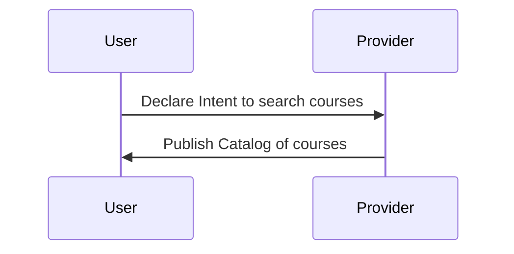

#### Beckn Protocol API Workflow

In beckn protocol, the search intent generated by the BAP is typically published on the gateway (BG) that broadcasts the intent to multiple Provider platforms (BPPs). Each of the BPPs return their catalogs directly to the BAP via asynchronous callbacks. The workflow for that is shown below.

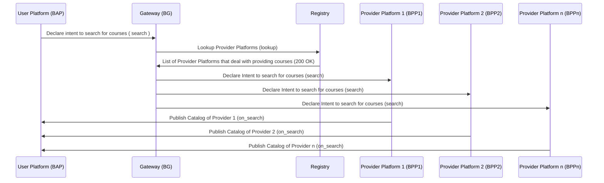

#### Example `search` request

```json
{
  "context": {
    "domain": "onest:courses",
    "transaction_id": "a9aaecca-10b7-4d19-b640-b047a7c62196",
    "message_id": "$bb579fb8-cb82-4824-be12-fcbc405b6608",
    "action": "search",
    "timestamp": "2022-12-15T05:23:03.443Z",
    "version": "1.1.0",
    "bap_uri": "https://onest-network.becknprotocol.io/",
    "bap_id": "onest.becknprotocol.io",
    "ttl": "PT10M"
  },
  "message": {
    "intent": {
      "item": {
        "descriptor": {
          "name": "english"
        }
      }
    }
  }
}
```

#### Example `on_search` request

```json
{
  "context": {
    "domain": "onest:courses",
    "version": "1.1.0",
    "action": "on_search",
    "bap_id": "onest.becknprotocol.io",
    "bap_uri": "https://onest-network.becknprotocol.io/",
    "transaction_id": "a9aaecca-10b7-4d19-b640-b047a7c62196",
    "message_id": "7db91181-718f-4720-83de-88e36e9f854e",
    "ttl": "PT10M",
    "timestamp": "2023-02-22T10:30:18.145Z",
    "bpp_id": "infosys.springboard.io",
    "bpp_uri": "https://infosys.springboard.io"
  },
  "message": {
    "catalog": {
      "descriptor": {
        "name": "Catalog for English courses"
      },
      "providers": [
        {
          "id": "INFOSYS",
          "descriptor": {
            "name": "Infosys Springboard",
            "short_desc": "Infosys Springboard Digital literacy program",
            "images": [
              {
                "url": "https://infyspringboard.onwingspan.com/web/assets/images/infosysheadstart/app_logos/landing-new.png",
                "size_type": "sm"
              }
            ]
          },
          "categories": [
            {
              "id": "LANGUAGE-COURSES",
              "descriptor": {
                "code": "LANGUAGE-COURSES",
                "name": "Language Courses"
              }
            },
            {
              "id": "SKILL-DEVELOPMENT-COURSES",
              "descriptor": {
                "code": "SKILL-DEVELOPMENT-COURSES",
                "name": "Skill development Courses"
              }
            },
            {
              "id": "TECHNICAL-COURSES",
              "descriptor": {
                "code": "TECHNICAL-COURSES",
                "name": "Technical Courses"
              }
            }
          ],
          "items": [
            {
              "id": "d4975df5-b18c-4772-80ad-368669856d52",
              "quantity": {
                "maximum": 1
              },
              "descriptor": {
                "name": "Everyday Conversational English",
                "long_desc": "Everyday Conversational English",
                "images": [
                  {
                    "url": "https://infyspringboard.onwingspan.com/web/assets/images/infosysheadstart/everyday-conversational-english.png"
                  }
                ],
                "media": [
                  {
                    "url": "https://infyspringboard.onwingspan.com/web/courses/infosysheadstart/everyday-conversational-english/preview/"
                  }
                ]
              },
              "price": {
                "currency": "INR",
                "value": "0"
              },
              "category_ids": ["LANGUAGE-COURSES"],
              "rating": "4.5",
              "rateable": true
            },
            {
              "id": "58449592-c4f2-4971-8e23-1da2515042c2",
              "quantity": {
                "maximum": 1
              },
              "descriptor": {
                "name": "English Grammar and Usage",
                "long_desc": "English Grammar and Usage",
                "images": [
                  {
                    "url": "https://infyspringboard.onwingspan.com/web/assets/images/infosysheadstart/english-grammar-and-usage.png"
                  }
                ],
                "media": [
                  {
                    "url": "https://infyspringboard.onwingspan.com/web/courses/infosysheadstart/english-grammar-and-usage/preview/"
                  }
                ]
              },
              "price": {
                "currency": "INR",
                "value": "0"
              },
              "category_ids": ["LANGUAGE-COURSES"],
              "rating": "4.2",
              "rateable": true
            }
          ],
          "fulfillments": [
            {
              "agent": {
                "person": {
                  "id": "eng-01-prof",
                  "name": "Prof. Shipra Vaidya"
                }
              }
            }
          ]
        }
      ]
    }
  }
}
```

### Select a course for booking

1. User selects courses from the list which satisfies the requirements
2. The provider sends the draft order with the interim quote to the user, with additional details of the product.

#### User-side Actions

- Selecting courses from the catalogs

#### Provider-side Actions

- Receive user's selection of courses
- Provider sends draft order for the selected courses with a quoted
- Provider sends in additional information about the courses selected

#### Logical Workflow

The below diagram illustrates the logical interactions between a EV user and Provider during the Selecting service/product stage

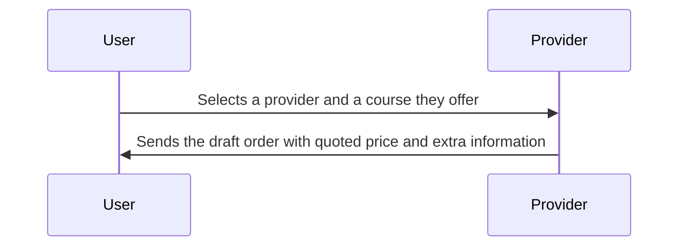

#### Beckn Protocol API Workflow

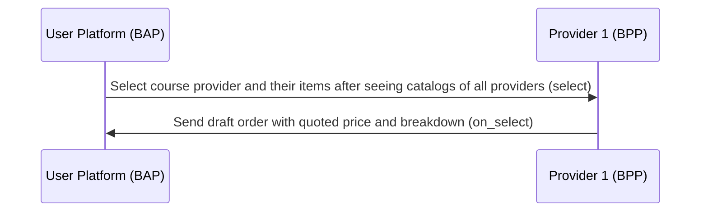

#### Example `select` request

```json
{
  "context": {
    "domain": "onest:courses",
    "action": "select",
    "version": "1.1.0",
    "bap_id": "onest.becknprotocol.io",
    "bap_uri": "https://onest-network.becknprotocol.io/",
    "transaction_id": "a9aaecca-10b7-4d19-b640-b047a7c62196",
    "message_id": "$bb579fb8-cb82-4824-be12-fcbc405b6608",
    "timestamp": "2022-12-12T09:55:41.161Z",
    "ttl": "PT10M",
    "bpp_id": "infosys.springboard.io",
    "bpp_uri": "https://infosys.springboard.io"
  },
  "message": {
    "order": {
      "provider": {
        "id": "INFOSYS"
      },
      "items": [
        {
          "id": "d4975df5-b18c-4772-80ad-368669856d52"
        }
      ]
    }
  }
}
```

#### Example `on_select` request

```json
{
  "context": {
    "domain": "onest:courses",
    "version": "1.1.0",
    "action": "on_select",
    "bap_id": "onest.becknprotocol.io",
    "bap_uri": "https://onest-network.becknprotocol.io/",
    "bpp_id": "infosys.springboard.io",
    "bpp_uri": "https://infosys.springboard.io",
    "transaction_id": "a9aaecca-10b7-4d19-b640-b047a7c62196",
    "message_id": "d514a38f-e112-4bb8-a3d8-b8e5d8dea82d",
    "ttl": "PT10M",
    "timestamp": "2023-02-20T15:21:36.925Z"
  },
  "message": {
    "order": {
      "provider": {
        "id": "INFOSYS",
        "descriptor": {
          "name": "Infosys Springboard",
          "short_desc": "Infosys Springboard Digital literacy program",
          "images": [
            {
              "url": "https://infyspringboard.onwingspan.com/web/assets/images/infosysheadstart/app_logos/landing-new.png",
              "size_type": "sm"
            }
          ]
        },
        "categories": [
          {
            "id": "LANGUAGE-COURSES",
            "descriptor": {
              "code": "LANGUAGE-COURSES",
              "name": "Language Courses"
            }
          },
          {
            "id": "SKILL-DEVELOPMENT-COURSES",
            "descriptor": {
              "code": "SKILL-DEVELOPMENT-COURSES",
              "name": "Skill development Courses"
            }
          },
          {
            "id": "TECHNICAL-COURSES",
            "descriptor": {
              "code": "TECHNICAL-COURSES",
              "name": "Technical Courses"
            }
          }
        ]
      },
      "items": [
        {
          "id": "d4975df5-b18c-4772-80ad-368669856d52",
          "quantity": {
            "maximum": 1
          },
          "descriptor": {
            "name": "Everyday Conversational English",
            "long_desc": "Everyday Conversational English",
            "images": [
              {
                "url": "https://infyspringboard.onwingspan.com/web/assets/images/infosysheadstart/everyday-conversational-english.png"
              }
            ],
            "media": [
              {
                "url": "https://infyspringboard.onwingspan.com/web/courses/infosysheadstart/everyday-conversational-english/preview/"
              }
            ]
          },
          "price": {
            "currency": "INR",
            "value": "0"
          },
          "category_ids": ["LANGUAGE-COURSES"],
          "rating": "4.5",
          "tags": [
            {
              "descriptor": {
                "code": "course-highlights",
                "name": "Course Highlights"
              },
              "list": [
                {
                  "descriptor": {
                    "code": "highlight",
                    "name": "highlight-1"
                  },
                  "value": "Focusing on clear pronunciation and reducing any strong accents that may impede communication."
                },
                {
                  "descriptor": {
                    "code": "highlight",
                    "name": "highlight-2"
                  },
                  "value": "Expanding everyday vocabulary to facilitate common conversations."
                }
              ],
              "display": true
            },
            {
              "descriptor": {
                "code": "course-prerequisites",
                "name": "Course Prerequisites"
              },
              "list": [
                {
                  "descriptor": {
                    "code": "prerequisite",
                    "name": "prerequisite-1"
                  },
                  "value": "Should have a basic understanding of English"
                },
                {
                  "descriptor": {
                    "code": "prerequisite",
                    "name": "prerequisite-2"
                  },
                  "value": "Access to a computer or internet to access the course online"
                }
              ],
              "display": true
            }
          ],
          "rateable": true
        }
      ],
      "quote": {
        "price": {
          "currency": "INR",
          "value": "0"
        }
      },
      "fulfillments": [
        {
          "agent": {
            "person": {
              "id": "eng-01-prof",
              "name": "Prof. Shipra Vaidya"
            }
          }
        }
      ],
      "type": "DEFAULT"
    }
  }
}
```

### Order Initialization

In this stage, the User provides the required information and initiates the order

#### User-side Actions

- User provides the billing details `Name`, `Email ID` and `Phone Number`
- User updates the payment details and initiates the order

#### Provider-side Actions

- Request for billing details
- Receive billing details from the user
- Send draft order with payment and fulfillment terms

#### Logical Workflow

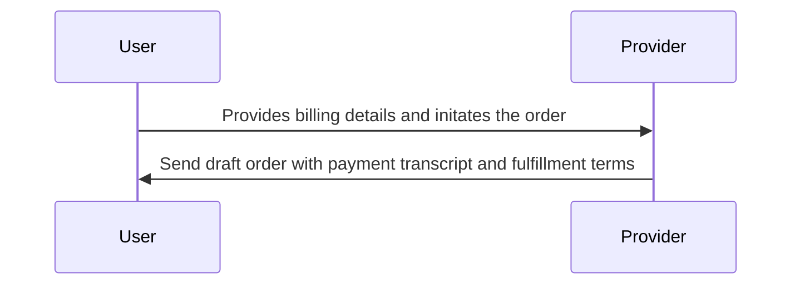

#### Beckn Protocol API Workflow

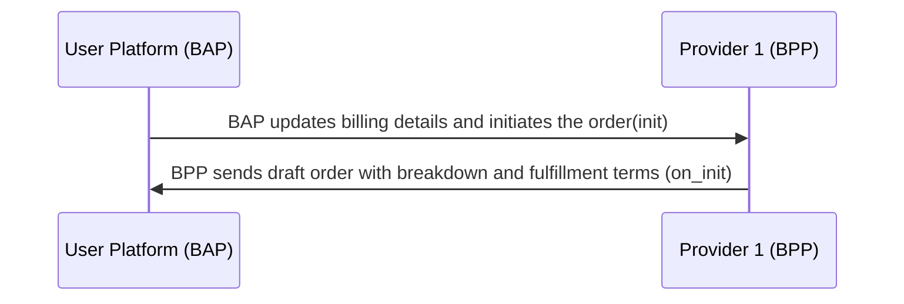

#### Example `init` request

```json
{
  "context": {
    "domain": "onest:courses",
    "action": "init",
    "version": "1.1.0",
    "bap_id": "onest.becknprotocol.io",
    "bap_uri": "https://onest-network.becknprotocol.io/",
    "transaction_id": "a9aaecca-10b7-4d19-b640-b047a7c62196",
    "message_id": "$bb579fb8-cb82-4824-be12-fcbc405b6608",
    "timestamp": "2022-12-12T09:55:41.161Z",
    "ttl": "PT10M",
    "bpp_id": "infosys.springboard.io",
    "bpp_uri": "https://infosys.springboard.io"
  },
  "message": {
    "order": {
      "provider": {
        "id": "INFOSYS"
      },
      "items": [
        {
          "id": "d4975df5-b18c-4772-80ad-368669856d52"
        }
      ],
      "billing": {
        "name": "Namma Yatri",
        "organization": {
          "address": "Girija Building, Number 817, Ganapathi Temple Rd",
          "city": "Bengaluru",
          "state": "Karnataka",
          "contact": {
            "email": "nammayatri.support@juspay.in",
            "phone": "+91 80 68501060"
          }
        }
      },
      "fulfillments": [
        {
          "customer": {
            "person": {
              "name": "Manjunath"
            },
            "contact": {
              "phone": "+91 9988764321",
              "email": "manjunath@gmail.com"
            }
          }
        }
      ]
    }
  }
}
```

#### Example `on_init` request

```json
{
  "context": {
    "domain": "onest:courses",
    "version": "1.1.0",
    "action": "on_init",
    "bap_id": "onest.becknprotocol.io",
    "bap_uri": "https://onest-network.becknprotocol.io/",
    "bpp_id": "infosys.springboard.io",
    "bpp_uri": "https://infosys.springboard.io",
    "transaction_id": "a9aaecca-10b7-4d19-b640-b047a7c62196",
    "message_id": "d514a38f-e112-4bb8-a3d8-b8e5d8dea82d",
    "ttl": "PT10M",
    "timestamp": "2023-02-20T15:21:36.925Z"
  },
  "message": {
    "order": {
      "provider": {
        "id": "INFOSYS",
        "descriptor": {
          "name": "Infosys Springboard",
          "short_desc": "Infosys Springboard Digital literacy program",
          "images": [
            {
              "url": "https://infyspringboard.onwingspan.com/web/assets/images/infosysheadstart/app_logos/landing-new.png",
              "size_type": "sm"
            }
          ]
        }
      },
      "items": [
        {
          "id": "d4975df5-b18c-4772-80ad-368669856d52",
          "quantity": {
            "maximum": 1
          },
          "descriptor": {
            "name": "Everyday Conversational English",
            "long_desc": "Everyday Conversational English",
            "images": [
              {
                "url": "https://infyspringboard.onwingspan.com/web/assets/images/infosysheadstart/everyday-conversational-english.png"
              }
            ],
            "media": [
              {
                "url": "https://infyspringboard.onwingspan.com/web/courses/infosysheadstart/everyday-conversational-english/preview/"
              }
            ]
          },
          "price": {
            "currency": "INR",
            "value": "0"
          },
          "category_ids": ["LANGUAGE-COURSES"],
          "rating": "4.5",
          "tags": [
            {
              "descriptor": {
                "code": "course-highlights",
                "name": "Course Highlights"
              },
              "list": [
                {
                  "descriptor": {
                    "code": "highlight",
                    "name": "highlight-1"
                  },
                  "value": "Focusing on clear pronunciation and reducing any strong accents that may impede communication."
                },
                {
                  "descriptor": {
                    "code": "highlight",
                    "name": "highlight-2"
                  },
                  "value": "Expanding everyday vocabulary to facilitate common conversations."
                }
              ],
              "display": true
            },
            {
              "descriptor": {
                "code": "course-prerequisites",
                "name": "Course Prerequisites"
              },
              "list": [
                {
                  "descriptor": {
                    "code": "prerequisite",
                    "name": "prerequisite-1"
                  },
                  "value": "Should have a basic understanding of English"
                },
                {
                  "descriptor": {
                    "code": "prerequisite",
                    "name": "prerequisite-2"
                  },
                  "value": "Access to a computer or internet to access the course online"
                }
              ],
              "display": true
            }
          ],
          "rateable": true
        }
      ],
      "billing": {
        "name": "Namma Yatri",
        "organization": {
          "address": "Girija Building, Number 817, Ganapathi Temple Rd",
          "city": "Bengaluru",
          "state": "Karnataka",
          "contact": {
            "email": "nammayatri.support@juspay.in",
            "phone": "+91 80 68501060"
          }
        }
      },
      "quote": {
        "price": {
          "currency": "INR",
          "value": "0"
        }
      },
      "fulfillments": [
        {
          "customer": {
            "person": {
              "name": "Manjunath"
            },
            "contact": {
              "phone": "+91 9988764321",
              "email": "manjunath@gmail.com"
            }
          },
          "agent": {
            "person": {
              "id": "eng-01-prof",
              "name": "Prof. Shipra Vaidya"
            }
          },
          "state": {
            "descriptor": {
              "code": "order-initialized",
              "name": "Order Initialized"
            }
          }
        }
      ],
      "payments": [
        {
          "params": {
            "amount": "0",
            "currency": "INR"
          },
          "status": "PAID"
        }
      ],
      "type": "DEFAULT"
    }
  }
}
```

### Order Confirmation, status and update

In this stage, the User confirms the final draft and gets a order placed. The user will then get all the chapters unlocked in the course, with regular status updates when the chapters are completed or are in progress.

#### User-side Actions

- Confirms the order by agreeing to fulfillment terms and completing the payment.

#### Provider-side Actions

- Receive order confirmation from the user
- Send active confirmed order to the user
- Provide the latest status of the order to the user
- When the user starts the course/chapter, ends the course or chapter, it sends an `on_status` to intimate the user of the progress of the course.

#### Logical Workflow

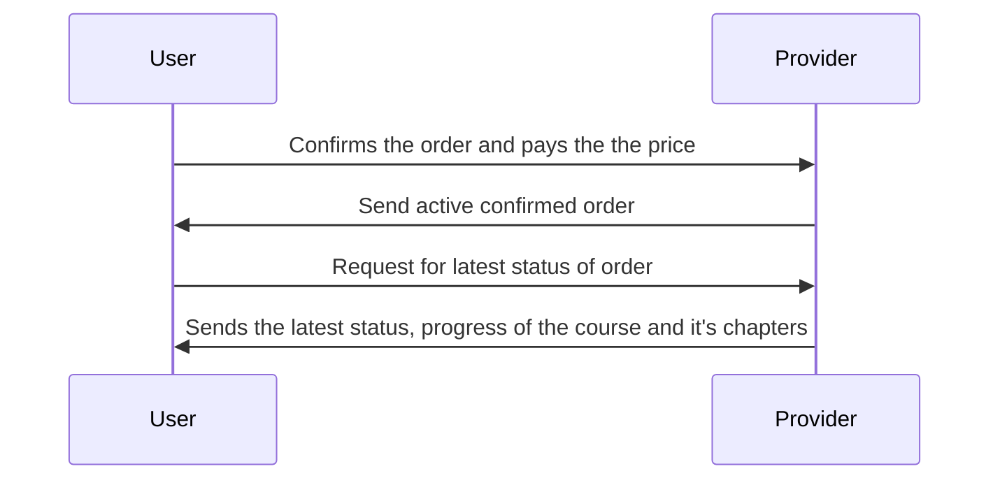

### Beckn API Workflow

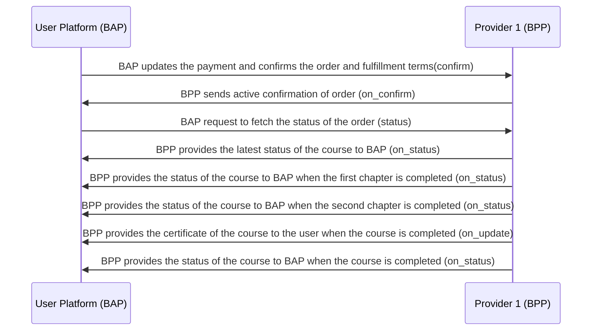

#### Example `confirm` request

```json
{
  "context": {
    "domain": "onest:courses",
    "action": "confirm",
    "version": "1.1.0",
    "bap_id": "onest.becknprotocol.io",
    "bap_uri": "https://onest-network.becknprotocol.io/",
    "transaction_id": "a9aaecca-10b7-4d19-b640-b047a7c62196",
    "message_id": "$bb579fb8-cb82-4824-be12-fcbc405b6608",
    "timestamp": "2022-12-12T09:55:41.161Z",
    "ttl": "PT10M",
    "bpp_id": "infosys.springboard.io",
    "bpp_uri": "https://infosys.springboard.io"
  },
  "message": {
    "order": {
      "provider": {
        "id": "INFOSYS"
      },
      "items": [
        {
          "id": "d4975df5-b18c-4772-80ad-368669856d52"
        }
      ],
      "billing": {
        "name": "Namma Yatri",
        "organization": {
          "address": "Girija Building, Number 817, Ganapathi Temple Rd",
          "city": "Bengaluru",
          "state": "Karnataka",
          "contact": {
            "email": "nammayatri.support@juspay.in",
            "phone": "+91 80 68501060"
          }
        }
      },
      "fulfillments": [
        {
          "customer": {
            "person": {
              "name": "Manjunath"
            },
            "contact": {
              "phone": "+91 9988764321",
              "email": "manjunath@gmail.com"
            }
          }
        }
      ],
      "payments": [
        {
          "params": {
            "amount": "0",
            "currency": "INR"
          },
          "status": "PAID"
        }
      ]
    }
  }
}
```

#### Example `on_confirm` request

```json
{
  "context": {
    "domain": "onest:courses",
    "version": "1.1.0",
    "action": "on_confirm",
    "bap_id": "onest.becknprotocol.io",
    "bap_uri": "https://onest-network.becknprotocol.io/",
    "bpp_id": "infosys.springboard.io",
    "bpp_uri": "https://infosys.springboard.io",
    "transaction_id": "a9aaecca-10b7-4d19-b640-b047a7c62196",
    "message_id": "d514a38f-e112-4bb8-a3d8-b8e5d8dea82d",
    "ttl": "PT10M",
    "timestamp": "2023-02-20T15:21:36.925Z"
  },
  "message": {
    "order": {
      "id": "d4975df5",
      "provider": {
        "id": "INFOSYS",
        "descriptor": {
          "name": "Infosys Springboard",
          "short_desc": "Infosys Springboard Digital literacy program",
          "images": [
            {
              "url": "https://infyspringboard.onwingspan.com/web/assets/images/infosysheadstart/app_logos/landing-new.png",
              "size_type": "sm"
            }
          ]
        }
      },
      "items": [
        {
          "id": "d4975df5-b18c-4772-80ad-368669856d52",
          "quantity": {
            "maximum": 1
          },
          "descriptor": {
            "name": "Everyday Conversational English",
            "long_desc": "Everyday Conversational English",
            "images": [
              {
                "url": "https://infyspringboard.onwingspan.com/web/assets/images/infosysheadstart/everyday-conversational-english.png"
              }
            ],
            "media": [
              {
                "url": "https://infyspringboard.onwingspan.com/web/courses/infosysheadstart/everyday-conversational-english/preview/"
              }
            ]
          },
          "price": {
            "currency": "INR",
            "value": "0"
          },
          "category_ids": ["LANGUAGE-COURSES"],
          "rating": "4.5",
          "tags": [
            {
              "descriptor": {
                "code": "course-highlights",
                "name": "Course Highlights"
              },
              "list": [
                {
                  "descriptor": {
                    "code": "highlight",
                    "name": "highlight-1"
                  },
                  "value": "Focusing on clear pronunciation and reducing any strong accents that may impede communication."
                },
                {
                  "descriptor": {
                    "code": "highlight",
                    "name": "highlight-2"
                  },
                  "value": "Expanding everyday vocabulary to facilitate common conversations."
                }
              ],
              "display": true
            },
            {
              "descriptor": {
                "code": "course-prerequisites",
                "name": "Course Prerequisites"
              },
              "list": [
                {
                  "descriptor": {
                    "code": "prerequisite",
                    "name": "prerequisite-1"
                  },
                  "value": "Should have a basic understanding of English"
                },
                {
                  "descriptor": {
                    "code": "prerequisite",
                    "name": "prerequisite-2"
                  },
                  "value": "Access to a computer or internet to access the course online"
                }
              ],
              "display": true
            }
          ],
          "rateable": true
        },
        {
          "id": "c9461edd-628d-46f3-820e-bab42b57d143",
          "parent_item_id": "d4975df5-b18c-4772-80ad-368669856d52",
          "descriptor": {
            "name": "Everyday Conversational English - Chapter 1",
            "long_desc": "Everyday Conversational English - Chapter 1",
            "images": [
              {
                "url": "https://infyspringboard.onwingspan.com/web/assets/images/infosysheadstart/everyday-conversational-english-ch1.png"
              }
            ],
            "media": [
              {
                "url": "https://infyspringboard.onwingspan.com/web/courses/infosysheadstart/everyday-conversational-english-ch1/"
              }
            ]
          }
        },
        {
          "id": "77223dc6-f6e4-48dd-bf0e-1e43841e651c",
          "parent_item_id": "d4975df5-b18c-4772-80ad-368669856d52",
          "descriptor": {
            "name": "Everyday Conversational English - Chapter 2",
            "long_desc": "Everyday Conversational English - Chapter 2",
            "images": [
              {
                "url": "https://infyspringboard.onwingspan.com/web/assets/images/infosysheadstart/everyday-conversational-english-ch2.png"
              }
            ],
            "media": [
              {
                "url": "https://infyspringboard.onwingspan.com/web/courses/infosysheadstart/everyday-conversational-english-ch2/"
              }
            ]
          }
        },
        {
          "id": "eae312ed-5a2a-4b95-bed8-407a832b11b8",
          "parent_item_id": "d4975df5-b18c-4772-80ad-368669856d52",
          "descriptor": {
            "name": "Everyday Conversational English - Chapter 3",
            "long_desc": "Everyday Conversational English - Chapter 3",
            "images": [
              {
                "url": "https://infyspringboard.onwingspan.com/web/assets/images/infosysheadstart/everyday-conversational-english-ch3.png"
              }
            ],
            "media": [
              {
                "url": "https://infyspringboard.onwingspan.com/web/courses/infosysheadstart/everyday-conversational-english-ch3/"
              }
            ]
          }
        }
      ],
      "billing": {
        "name": "Namma Yatri",
        "organization": {
          "address": "Girija Building, Number 817, Ganapathi Temple Rd",
          "city": "Bengaluru",
          "state": "Karnataka",
          "contact": {
            "email": "nammayatri.support@juspay.in",
            "phone": "+91 80 68501060"
          }
        }
      },
      "quote": {
        "price": {
          "currency": "INR",
          "value": "0"
        }
      },
      "fulfillments": [
        {
          "customer": {
            "person": {
              "name": "Manjunath"
            },
            "contact": {
              "phone": "+91 9988764321",
              "email": "manjunath@gmail.com"
            }
          },
          "agent": {
            "person": {
              "id": "eng-01-prof",
              "name": "Prof. Shipra Vaidya"
            }
          },
          "state": {
            "descriptor": {
              "code": "order-confirmed",
              "name": "Order Confirmed"
            }
          }
        }
      ],
      "payments": [
        {
          "params": {
            "amount": "0",
            "currency": "INR"
          },
          "status": "PAID"
        }
      ],
      "type": "DEFAULT"
    }
  }
}
```

#### Example `status` request

```json
{
  "context": {
    "domain": "onest:courses",
    "action": "status",
    "version": "1.1.0",
    "bap_id": "onest.becknprotocol.io",
    "bap_uri": "https://onest-network.becknprotocol.io/",
    "transaction_id": "a9aaecca-10b7-4d19-b640-b047a7c62196",
    "message_id": "$bb579fb8-cb82-4824-be12-fcbc405b6608",
    "timestamp": "2022-12-12T09:55:41.161Z",
    "ttl": "PT10M",
    "bpp_id": "infosys.springboard.io",
    "bpp_uri": "https://infosys.springboard.io"
  },
  "message": {
    "order_id": "d4975df5"
  }
}
```

#### Example `on_status` request for course in progress

```json
{
  "context": {
    "domain": "onest:courses",
    "version": "1.1.0",
    "action": "on_status",
    "bap_id": "onest.becknprotocol.io",
    "bap_uri": "https://onest-network.becknprotocol.io/",
    "bpp_id": "infosys.springboard.io",
    "bpp_uri": "https://infosys.springboard.io",
    "transaction_id": "a9aaecca-10b7-4d19-b640-b047a7c62196",
    "message_id": "d514a38f-e112-4bb8-a3d8-b8e5d8dea82d",
    "ttl": "PT10M",
    "timestamp": "2023-02-20T15:21:36.925Z"
  },
  "message": {
    "order": {
      "id": "d4975df5",
      "provider": {
        "id": "INFOSYS",
        "descriptor": {
          "name": "Infosys Springboard",
          "short_desc": "Infosys Springboard Digital literacy program",
          "images": [
            {
              "url": "https://infyspringboard.onwingspan.com/web/assets/images/infosysheadstart/app_logos/landing-new.png",
              "size_type": "sm"
            }
          ]
        }
      },
      "items": [
        {
          "id": "d4975df5-b18c-4772-80ad-368669856d52",
          "quantity": {
            "maximum": 1
          },
          "descriptor": {
            "name": "Everyday Conversational English",
            "long_desc": "Everyday Conversational English",
            "images": [
              {
                "url": "https://infyspringboard.onwingspan.com/web/assets/images/infosysheadstart/everyday-conversational-english.png"
              }
            ],
            "media": [
              {
                "url": "https://infyspringboard.onwingspan.com/web/courses/infosysheadstart/everyday-conversational-english/preview/"
              }
            ]
          },
          "price": {
            "currency": "INR",
            "value": "0"
          },
          "category_ids": ["LANGUAGE-COURSES"],
          "rating": "4.5",
          "tags": [
            {
              "descriptor": {
                "code": "course-highlights",
                "name": "Course Highlights"
              },
              "list": [
                {
                  "descriptor": {
                    "code": "highlight",
                    "name": "highlight-1"
                  },
                  "value": "Focusing on clear pronunciation and reducing any strong accents that may impede communication."
                },
                {
                  "descriptor": {
                    "code": "highlight",
                    "name": "highlight-2"
                  },
                  "value": "Expanding everyday vocabulary to facilitate common conversations."
                }
              ],
              "display": true
            },
            {
              "descriptor": {
                "code": "course-prerequisites",
                "name": "Course Prerequisites"
              },
              "list": [
                {
                  "descriptor": {
                    "code": "prerequisite",
                    "name": "prerequisite-1"
                  },
                  "value": "Should have a basic understanding of English"
                },
                {
                  "descriptor": {
                    "code": "prerequisite",
                    "name": "prerequisite-2"
                  },
                  "value": "Access to a computer or internet to access the course online"
                }
              ],
              "display": true
            }
          ],
          "rateable": true
        },
        {
          "id": "c9461edd-628d-46f3-820e-bab42b57d143",
          "parent_item_id": "d4975df5-b18c-4772-80ad-368669856d52",
          "descriptor": {
            "name": "Everyday Conversational English - Chapter 1",
            "long_desc": "Everyday Conversational English - Chapter 1",
            "images": [
              {
                "url": "https://infyspringboard.onwingspan.com/web/assets/images/infosysheadstart/everyday-conversational-english-ch1.png"
              }
            ],
            "media": [
              {
                "url": "https://infyspringboard.onwingspan.com/web/courses/infosysheadstart/everyday-conversational-english-ch1/"
              }
            ]
          }
        },
        {
          "id": "77223dc6-f6e4-48dd-bf0e-1e43841e651c",
          "parent_item_id": "d4975df5-b18c-4772-80ad-368669856d52",
          "descriptor": {
            "name": "Everyday Conversational English - Chapter 2",
            "long_desc": "Everyday Conversational English - Chapter 2",
            "images": [
              {
                "url": "https://infyspringboard.onwingspan.com/web/assets/images/infosysheadstart/everyday-conversational-english-ch2.png"
              }
            ],
            "media": [
              {
                "url": "https://infyspringboard.onwingspan.com/web/courses/infosysheadstart/everyday-conversational-english-ch2/"
              }
            ]
          }
        },
        {
          "id": "eae312ed-5a2a-4b95-bed8-407a832b11b8",
          "parent_item_id": "d4975df5-b18c-4772-80ad-368669856d52",
          "descriptor": {
            "name": "Everyday Conversational English - Chapter 3",
            "long_desc": "Everyday Conversational English - Chapter 3",
            "images": [
              {
                "url": "https://infyspringboard.onwingspan.com/web/assets/images/infosysheadstart/everyday-conversational-english-ch3.png"
              }
            ],
            "media": [
              {
                "url": "https://infyspringboard.onwingspan.com/web/courses/infosysheadstart/everyday-conversational-english-ch3/"
              }
            ]
          }
        }
      ],
      "billing": {
        "name": "Namma Yatri",
        "organization": {
          "address": "Girija Building, Number 817, Ganapathi Temple Rd",
          "city": "Bengaluru",
          "state": "Karnataka",
          "contact": {
            "email": "nammayatri.support@juspay.in",
            "phone": "+91 80 68501060"
          }
        }
      },
      "quote": {
        "price": {
          "currency": "INR",
          "value": "0"
        }
      },
      "fulfillments": [
        {
          "customer": {
            "person": {
              "name": "Manjunath"
            },
            "contact": {
              "phone": "+91 9988764321",
              "email": "manjunath@gmail.com"
            }
          },
          "agent": {
            "person": {
              "id": "eng-01-prof",
              "name": "Prof. Shipra Vaidya"
            }
          },
          "state": {
            "descriptor": {
              "code": "chapter-completed",
              "name": "Chapter 1 has been completed"
            }
          }
        }
      ],
      "payments": [
        {
          "params": {
            "amount": "0",
            "currency": "INR"
          },
          "status": "PAID"
        }
      ],
      "type": "DEFAULT"
    }
  }
}
```

#### Example `on_status` request for course completion

```json
{
  "context": {
    "domain": "onest:courses",
    "version": "1.1.0",
    "action": "on_status",
    "bap_id": "onest.becknprotocol.io",
    "bap_uri": "https://onest-network.becknprotocol.io/",
    "bpp_id": "infosys.springboard.io",
    "bpp_uri": "https://infosys.springboard.io",
    "transaction_id": "a9aaecca-10b7-4d19-b640-b047a7c62196",
    "message_id": "d514a38f-e112-4bb8-a3d8-b8e5d8dea82d",
    "ttl": "PT10M",
    "timestamp": "2023-02-20T15:21:36.925Z"
  },
  "message": {
    "order": {
      "id": "d4975df5",
      "provider": {
        "id": "INFOSYS",
        "descriptor": {
          "name": "Infosys Springboard",
          "short_desc": "Infosys Springboard Digital literacy program",
          "images": [
            {
              "url": "https://infyspringboard.onwingspan.com/web/assets/images/infosysheadstart/app_logos/landing-new.png",
              "size_type": "sm"
            }
          ]
        }
      },
      "items": [
        {
          "id": "d4975df5-b18c-4772-80ad-368669856d52",
          "quantity": {
            "maximum": 1
          },
          "descriptor": {
            "name": "Everyday Conversational English",
            "long_desc": "Everyday Conversational English",
            "images": [
              {
                "url": "https://infyspringboard.onwingspan.com/web/assets/images/infosysheadstart/everyday-conversational-english.png"
              }
            ],
            "media": [
              {
                "url": "https://infyspringboard.onwingspan.com/web/courses/infosysheadstart/everyday-conversational-english/preview/"
              }
            ]
          },
          "price": {
            "currency": "INR",
            "value": "0"
          },
          "category_ids": ["LANGUAGE-COURSES"],
          "rating": "4.5",
          "tags": [
            {
              "descriptor": {
                "code": "course-highlights",
                "name": "Course Highlights"
              },
              "list": [
                {
                  "descriptor": {
                    "code": "highlight",
                    "name": "highlight-1"
                  },
                  "value": "Focusing on clear pronunciation and reducing any strong accents that may impede communication."
                },
                {
                  "descriptor": {
                    "code": "highlight",
                    "name": "highlight-2"
                  },
                  "value": "Expanding everyday vocabulary to facilitate common conversations."
                }
              ],
              "display": true
            },
            {
              "descriptor": {
                "code": "course-prerequisites",
                "name": "Course Prerequisites"
              },
              "list": [
                {
                  "descriptor": {
                    "code": "prerequisite",
                    "name": "prerequisite-1"
                  },
                  "value": "Should have a basic understanding of English"
                },
                {
                  "descriptor": {
                    "code": "prerequisite",
                    "name": "prerequisite-2"
                  },
                  "value": "Access to a computer or internet to access the course online"
                }
              ],
              "display": true
            }
          ],
          "rateable": true
        },
        {
          "id": "c9461edd-628d-46f3-820e-bab42b57d143",
          "parent_item_id": "d4975df5-b18c-4772-80ad-368669856d52",
          "descriptor": {
            "name": "Everyday Conversational English - Chapter 1",
            "long_desc": "Everyday Conversational English - Chapter 1",
            "images": [
              {
                "url": "https://infyspringboard.onwingspan.com/web/assets/images/infosysheadstart/everyday-conversational-english-ch1.png"
              }
            ],
            "media": [
              {
                "url": "https://infyspringboard.onwingspan.com/web/courses/infosysheadstart/everyday-conversational-english-ch1/"
              }
            ]
          }
        },
        {
          "id": "77223dc6-f6e4-48dd-bf0e-1e43841e651c",
          "parent_item_id": "d4975df5-b18c-4772-80ad-368669856d52",
          "descriptor": {
            "name": "Everyday Conversational English - Chapter 2",
            "long_desc": "Everyday Conversational English - Chapter 2",
            "images": [
              {
                "url": "https://infyspringboard.onwingspan.com/web/assets/images/infosysheadstart/everyday-conversational-english-ch2.png"
              }
            ],
            "media": [
              {
                "url": "https://infyspringboard.onwingspan.com/web/courses/infosysheadstart/everyday-conversational-english-ch2/"
              }
            ]
          }
        },
        {
          "id": "eae312ed-5a2a-4b95-bed8-407a832b11b8",
          "parent_item_id": "d4975df5-b18c-4772-80ad-368669856d52",
          "descriptor": {
            "name": "Everyday Conversational English - Chapter 3",
            "long_desc": "Everyday Conversational English - Chapter 3",
            "images": [
              {
                "url": "https://infyspringboard.onwingspan.com/web/assets/images/infosysheadstart/everyday-conversational-english-ch3.png"
              }
            ],
            "media": [
              {
                "url": "https://infyspringboard.onwingspan.com/web/courses/infosysheadstart/everyday-conversational-english-ch3/"
              }
            ]
          }
        }
      ],
      "billing": {
        "name": "Namma Yatri",
        "organization": {
          "address": "Girija Building, Number 817, Ganapathi Temple Rd",
          "city": "Bengaluru",
          "state": "Karnataka",
          "contact": {
            "email": "nammayatri.support@juspay.in",
            "phone": "+91 80 68501060"
          }
        }
      },
      "quote": {
        "price": {
          "currency": "INR",
          "value": "0"
        }
      },
      "fulfillments": [
        {
          "customer": {
            "person": {
              "name": "Manjunath"
            },
            "contact": {
              "phone": "+91 9988764321",
              "email": "manjunath@gmail.com"
            }
          },
          "agent": {
            "person": {
              "id": "eng-01-prof",
              "name": "Prof. Shipra Vaidya"
            }
          },
          "state": {
            "descriptor": {
              "code": "course-completed",
              "name": "Course completed",
              "short_desc": "The course Everyday Conversational English has been completed"
            }
          }
        }
      ],
      "payments": [
        {
          "params": {
            "amount": "0",
            "currency": "INR"
          },
          "status": "PAID"
        }
      ],
      "type": "DEFAULT"
    }
  }
}
```

#### Example `on_update` request for course completion

```json
{
  "context": {
    "domain": "onest:courses",
    "version": "1.1.0",
    "action": "on_update",
    "bap_id": "onest.becknprotocol.io",
    "bap_uri": "https://onest-network.becknprotocol.io/",
    "bpp_id": "infosys.springboard.io",
    "bpp_uri": "https://infosys.springboard.io",
    "transaction_id": "a9aaecca-10b7-4d19-b640-b047a7c62196",
    "message_id": "d514a38f-e112-4bb8-a3d8-b8e5d8dea82d",
    "ttl": "PT10M",
    "timestamp": "2023-02-20T15:21:36.925Z"
  },
  "message": {
    "order": {
      "id": "d4975df5",
      "provider": {
        "id": "INFOSYS",
        "descriptor": {
          "name": "Infosys Springboard",
          "short_desc": "Infosys Springboard Digital literacy program",
          "images": [
            {
              "url": "https://infyspringboard.onwingspan.com/web/assets/images/infosysheadstart/app_logos/landing-new.png",
              "size_type": "sm"
            }
          ]
        }
      },
      "items": [
        {
          "id": "d4975df5-b18c-4772-80ad-368669856d52",
          "quantity": {
            "maximum": 1
          },
          "descriptor": {
            "name": "Everyday Conversational English",
            "long_desc": "Everyday Conversational English",
            "images": [
              {
                "url": "https://infyspringboard.onwingspan.com/web/assets/images/infosysheadstart/everyday-conversational-english.png"
              }
            ],
            "media": [
              {
                "url": "https://infyspringboard.onwingspan.com/web/courses/infosysheadstart/everyday-conversational-english/preview/"
              }
            ]
          },
          "price": {
            "currency": "INR",
            "value": "0"
          },
          "category_ids": ["LANGUAGE-COURSES"],
          "rating": "4.5",
          "tags": [
            {
              "descriptor": {
                "code": "course-highlights",
                "name": "Course Highlights"
              },
              "list": [
                {
                  "descriptor": {
                    "code": "highlight",
                    "name": "highlight-1"
                  },
                  "value": "Focusing on clear pronunciation and reducing any strong accents that may impede communication."
                },
                {
                  "descriptor": {
                    "code": "highlight",
                    "name": "highlight-2"
                  },
                  "value": "Expanding everyday vocabulary to facilitate common conversations."
                }
              ],
              "display": true
            },
            {
              "descriptor": {
                "code": "course-prerequisites",
                "name": "Course Prerequisites"
              },
              "list": [
                {
                  "descriptor": {
                    "code": "prerequisite",
                    "name": "prerequisite-1"
                  },
                  "value": "Should have a basic understanding of English"
                },
                {
                  "descriptor": {
                    "code": "prerequisite",
                    "name": "prerequisite-2"
                  },
                  "value": "Access to a computer or internet to access the course online"
                }
              ],
              "display": true
            }
          ],
          "rateable": true
        },
        {
          "id": "c9461edd-628d-46f3-820e-bab42b57d143",
          "parent_item_id": "d4975df5-b18c-4772-80ad-368669856d52",
          "descriptor": {
            "name": "Everyday Conversational English - Chapter 1",
            "long_desc": "Everyday Conversational English - Chapter 1",
            "images": [
              {
                "url": "https://infyspringboard.onwingspan.com/web/assets/images/infosysheadstart/everyday-conversational-english-ch1.png"
              }
            ],
            "media": [
              {
                "url": "https://infyspringboard.onwingspan.com/web/courses/infosysheadstart/everyday-conversational-english-ch1/"
              }
            ]
          }
        },
        {
          "id": "77223dc6-f6e4-48dd-bf0e-1e43841e651c",
          "parent_item_id": "d4975df5-b18c-4772-80ad-368669856d52",
          "descriptor": {
            "name": "Everyday Conversational English - Chapter 2",
            "long_desc": "Everyday Conversational English - Chapter 2",
            "images": [
              {
                "url": "https://infyspringboard.onwingspan.com/web/assets/images/infosysheadstart/everyday-conversational-english-ch2.png"
              }
            ],
            "media": [
              {
                "url": "https://infyspringboard.onwingspan.com/web/courses/infosysheadstart/everyday-conversational-english-ch2/"
              }
            ]
          }
        },
        {
          "id": "eae312ed-5a2a-4b95-bed8-407a832b11b8",
          "parent_item_id": "d4975df5-b18c-4772-80ad-368669856d52",
          "descriptor": {
            "name": "Everyday Conversational English - Chapter 3",
            "long_desc": "Everyday Conversational English - Chapter 3",
            "images": [
              {
                "url": "https://infyspringboard.onwingspan.com/web/assets/images/infosysheadstart/everyday-conversational-english-ch3.png"
              }
            ],
            "media": [
              {
                "url": "https://infyspringboard.onwingspan.com/web/courses/infosysheadstart/everyday-conversational-english-ch3/"
              }
            ]
          }
        }
      ],
      "billing": {
        "name": "Namma Yatri",
        "organization": {
          "address": "Girija Building, Number 817, Ganapathi Temple Rd",
          "city": "Bengaluru",
          "state": "Karnataka",
          "contact": {
            "email": "nammayatri.support@juspay.in",
            "phone": "+91 80 68501060"
          }
        }
      },
      "quote": {
        "price": {
          "currency": "INR",
          "value": "0"
        }
      },
      "fulfillments": [
        {
          "customer": {
            "person": {
              "name": "Manjunath",
              "creds": {
                "type": "VerifiableCredential",
                "url": "https://infyspringboard.onwingspan.com/web/courses/infosysheadstart/everyday-conversational-english/certificate"
              }
            },
            "contact": {
              "phone": "+91 9988764321",
              "email": "manjunath@gmail.com"
            }
          },
          "agent": {
            "person": {
              "id": "eng-01-prof",
              "name": "Prof. Shipra Vaidya"
            }
          },
          "state": {
            "descriptor": {
              "code": "certificate-issued",
              "name": "A certificate has been issued after the completion of the course"
            }
          }
        }
      ],
      "payments": [
        {
          "params": {
            "amount": "0",
            "currency": "INR"
          },
          "status": "PAID"
        }
      ],
      "type": "DEFAULT"
    }
  }
}
```

### Order rating

#### User-side Actions

- Request to rate the order

##### Provider-side Actions

- Rates the order of the BAP

#### Logical Worklow

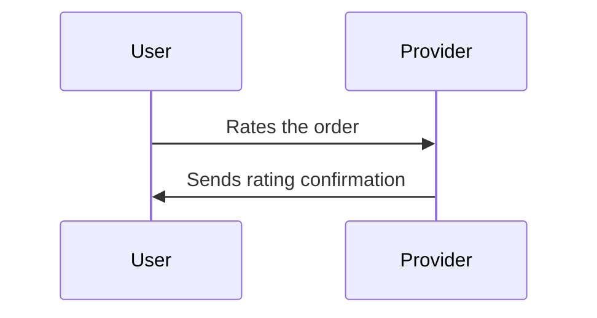

#### Beckn API Workflow

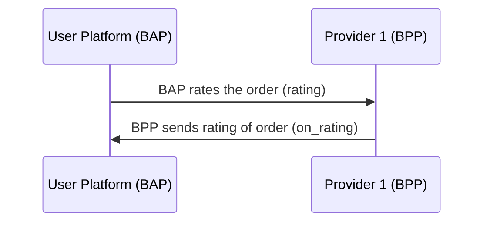

#### example `rating` request

```json
{
  "context": {
    "domain": "onest:courses",
    "action": "rating",
    "version": "1.1.0",
    "bap_id": "onest.becknprotocol.io",
    "bap_uri": "https://onest-network.becknprotocol.io/",
    "transaction_id": "a9aaecca-10b7-4d19-b640-b047a7c62196",
    "message_id": "$bb579fb8-cb82-4824-be12-fcbc405b6608",
    "timestamp": "2022-12-12T09:55:41.161Z",
    "ttl": "PT10M",
    "bpp_id": "infosys.springboard.io",
    "bpp_uri": "https://infosys.springboard.io"
  },
  "message": {
    "ratings": {
      "id": "d4975df5",
      "rating_category": "COURSE",
      "value": "4"
    }
  }
}
```

#### example `on_rating` request

```json
{
  "context": {
    "domain": "onest:courses",
    "action": "on_rating",
    "version": "1.1.0",
    "bap_id": "onest.becknprotocol.io",
    "bap_uri": "https://onest-network.becknprotocol.io/",
    "transaction_id": "a9aaecca-10b7-4d19-b640-b047a7c62196",
    "message_id": "$bb579fb8-cb82-4824-be12-fcbc405b6608",
    "timestamp": "2022-12-12T09:55:41.161Z",
    "ttl": "PT10M",
    "bpp_id": "infosys.springboard.io",
    "bpp_uri": "https://infosys.springboard.io"
  },
  "message": {
    "feedback_form": {
      "form": {
        "url": "https://infosys.springboard.io/rating?course=d4975df5-b18c-4772-80ad-368669856d52"
      },
      "required": "false"
    }
  }
}
```

### Order support

#### User-side Actions

- Request to get support for the order

##### Provider-side Actions

- Provides support to the BAP

#### Logical Worklow

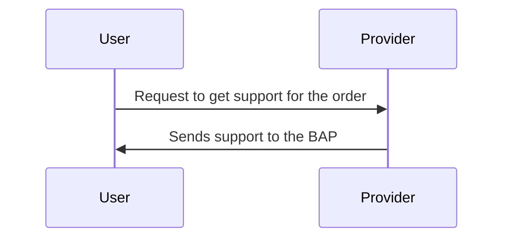

#### Beckn API Workflow

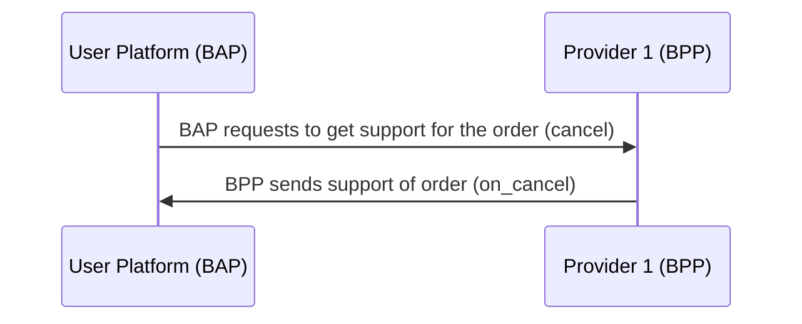

#### example `support` request

```json
{
  "context": {
    "domain": "onest:courses",
    "action": "support",
    "version": "1.1.0",
    "bap_id": "onest.becknprotocol.io",
    "bap_uri": "https://onest-network.becknprotocol.io/",
    "transaction_id": "a9aaecca-10b7-4d19-b640-b047a7c62196",
    "message_id": "$bb579fb8-cb82-4824-be12-fcbc405b6608",
    "timestamp": "2022-12-12T09:55:41.161Z",
    "ttl": "PT10M",
    "bpp_id": "infosys.springboard.io",
    "bpp_uri": "https://infosys.springboard.io"
  },
  "message": {
    "support": {
      "ref_id": "d4975df5",
      "callback_phone": "+91 9988776543",
      "phone": "+91 9988776543",
      "email": "manjunath@gmail.com"
    }
  }
}
```

#### example `on_support` request

```json
{
  "context": {
    "domain": "onest:courses",
    "action": "on_support",
    "version": "1.1.0",
    "bap_id": "onest.becknprotocol.io",
    "bap_uri": "https://onest-network.becknprotocol.io/",
    "transaction_id": "a9aaecca-10b7-4d19-b640-b047a7c62196",
    "message_id": "$bb579fb8-cb82-4824-be12-fcbc405b6608",
    "timestamp": "2022-12-12T09:55:41.161Z",
    "ttl": "PT10M",
    "bpp_id": "infosys.springboard.io",
    "bpp_uri": "https://infosys.springboard.io"
  },
  "message": {
    "support": {
      "ref_id": "d4975df5-b18c-4772-80ad-368669856d52",
      "callback_phone": "+91 9988776543",
      "phone": "+91 9988776543",
      "email": "infosys.springboard@support.com"
    }
  }
}
```
